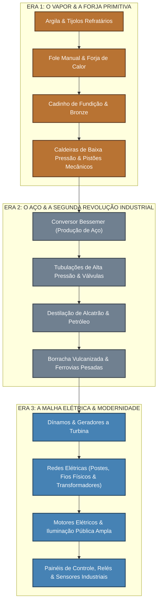

# 🏭 Industry Made — Documento de Design, Filosofia & Roadmap

> Este documento sintetiza toda a visão de game design, análise de problemas do Minecraft vanilla, arquitetura técnica e o roadmap de desenvolvimento do mod **Industry Made**.
> Criado para servir de bússola para o desenvolvimento, seja no ambiente IDE ou no **Antigravity CLI (`agy`)**.

---

## 1. Visão do Projeto & Filosofia de Design

### 1.1 O Diagnóstico: O "Vazio" do Minecraft Vanilla (A Fase de 2 Semanas)
Estudos de game design sobre o fenômeno da *"fase de 2 semanas"* do Minecraft apontam 4 falhas estruturais no jogo base:
1. **O Efeito "Museu Abandonado" (Amnésia do Mundo):** O mundo não reage ao jogador. Você pode erguer um império, mas o mundo permanece estático e indiferente: aldeões continuam parados, mobs são gerados aleatoriamente sem propósito e o mundo não "lembra" da sua presença.
2. **O Abismo de Dopamina:** No início, recompensas surgem a cada 5 minutos (madeira ➔ pedra ➔ ferro ➔ casa). Com diamantes, armadura encantada (*Mending*) e comida farta, o loop intrínseco se esgota. O jogo exige que o jogador "invente trabalho", gerando exaustão sem satisfação.
3. **A Elytra e o Encolhimento do Mapa:** Voar pelo teto do mundo faz com que o relevo, rios, florestas e perigos deixem de existir no gameplay real.
4. **Farms "Exploit" sem Alma:** As farms vanilla exploram quebras de IA de monstros em buracos 1x1, passando a sensação de abuso de bugs em vez de verdadeira engenharia.

### 1.2 A Inspiração: A Filosofia "Matcha Flavoured"
Assim como o *Matcha Flavoured* revolucionou o survival com sua abordagem Vanilla+ profunda (removendo a regeneração passiva e dando valor real à culinária e ligas com utilidade contextual), o **Industry Made** propõe reinventar a tecnologia sob a mesma ótica:
* **Respeito à identidade estética e ao espírito do Minecraft.**
* **Sem power-creep absurdo** (nada de máquinas mágicas que duplicam tudo infinitamente sem esforço).
* **Foco em experiência tangível, física e recompensadora.**

### 1.3 Os 4 Pilares do Industry Made
1. **Engenharia no Mundo (Zero "Magic Gray Boxes"):** As transformações ocorrem no mundo físico. Em vez de abrir uma interface 2D cinza para processar minérios, o jogador vê o fole insuflando oxigênio, a chama ficando azulada, o cadinho brilhando em brasa e o metal derretido escorrendo em moldes de areia/argila.
2. **A Geografia Importa (Fim da Base Subterrânea Isolada):** A tecnologia depende do ecossistema. Rios caudalosos geram energia hidráulica; montanhas oferecem vento e minérios nobres; vales guardam argilas e carvão; desertos e oceanos escondem salmoura e petróleo. Isso força o jogador a criar **redes logísticas reais** (ferrovias, barcaças, linhas de transmissão), dando vida e escala ao mapa.
3. **O Mundo com Pulso (Feedback Cinestésico & Sonoro):** A base industrial é um organismo vivo. Ela produz o som rítmico e grave de pistões a vapor, o assobio de válvulas de alívio, chaminés soltando fumaça densa contra o luar e iluminação pública que afasta o breu da noite.
4. **Propósito Real para a Indústria:** A produção não é para acumular baús com 1 milhão de lingotes à toa; ela destrava infraestrutura de transporte continental, maquinário de terraformação e materiais de alta resistência para conquistar biomas hostis.

### 1.4 A Filosofia de Falha: Desafio de Engenharia vs Destruição Punitiva
Uma das maiores causas de desistência em mods de tecnologia antigos (como IndustrialCraft ou GregTech) eram **explosões que destruíam a base**:
* **A Regra de Ouro do Industry Made:** Máquinas **NUNCA** explodem abrindo crateras na sua construção.
* **Falhas Consequenciais e Interativas:**
  * Superaquecimento provoca vazamento de vapor quente sob alta pressão (emite assobio estridente e queima entidades próximas).
  * Excesso de torque ou falta de lubrificação emperra o sistema com um som metálico de atrito e fumaça cinzenta.
  * O jogador resolve o problema com engenharia: aliviando a válvula, ligando um circuito de resfriamento ou usando uma chave inglesa para desatolar.

### 1.5 O "Game Feel" & Design Sonoro (Combate ao Vazio)
A razão pela qual mods como *Create* e jogos como *Factorio* e *Satisfactory* são tão viciantes é o **Game Feel (Juice)**:
* **Áudio Posicional Rítmico:** O som do fole inflando e soprando ar, o ruído sordo do pistão a vapor em marcha lenta, o borbulhar do metal líquido no cadinho e o zumbido sutil de alta voltagem nos transformadores.
* **Luz e Partículas:** Em vez de interfaces gráficas estáticas, forjas abertas projetam luz alaranjada dinâmica que ilumina os blocos ao redor; chaminés soltam plumas de fumaça que mudam de cor conforme o combustível queimado (lenha, carvão ou coque).

### 1.6 O Mundo Vivo: Vilas & Autômatos Auxiliares
Para que o jogador não se sinta o "fantasma solitário" em um mundo morto:
* **Eletrificação & Apoio a Vilas:** Levar água encanada e eletricidade a vilarejos rurais acende postes de luz públicos (eliminando monstros na vila sem a poluição visual de tochas no chão) e desbloqueia trabalhadores industriais que vendem peças ou compram excedentes de energia.
* **Autômatos Mecânicos (Steam/Clockwork Golems):** Pequenos construtos movidos a corda ou carvão que carregam carrinhos de mina, acionam alavancas e operam foles, dando a sensação de uma oficina habitada e funcional.

---

## 2. A Progressão Tecnológica em 3 Eras



### Era 1: Vapor & Forja Primitiva (Mecânica e Calor)
* **Metalurgia por Calor Real:** Misturar argila e areia para tijolos refratários; montar a primeira câmara de forja com fole manual. O oxigênio forçado eleva a temperatura até o ponto de fusão do cobre e estanho para criar **Bronze** e refinar **Ferro Forjado**.
* **Caldeiras & Vapor:** Água + Calor = Vapor sob pressão. Movimenta martelos de forja, bombas de drenagem de água e serrarias mecânicas.

### Era 2: O Aço & Química de Transição
* **Aço Real:** O ferro não resiste à alta pressão. Usar o conversor Bessemer soprando ar em ferro fundido para reduzir o carbono e produzir aço.
* **Destilação & Tubulações Resistentes:** Processamento de carvão em coque, alcatrão e lubrificantes. Guindastes, locomotivas pesadas e esteiras de carga.

### Era 3: A Malha Elétrica & Modernidade
* **Geração & Transmissão:** O vapor gira turbinas acopladas a dínamos elétricos.
* **Fiação no Mundo:** Fios de cobre e alumínio estendidos fisicamente entre postes de madeira e torres de alta tensão cortando vales e florestas.
* **Automação & Luz:** Motores elétricos compactos, transformadores de voltagem, iluminação pública que torna vilas seguras e autômatos mecânicos de suporte.

---

## 3. Arquitetura Técnica & Ambiente de Desenvolvimento

* **Mod Loader:** Fabric Loader `0.19.5`
* **Minecraft Version:** `26.1.2`
* **Loom Version:** `1.18.2` (Fabric Loom)
* **Linguagem:** Kotlin `2.4.20` (`fabric-language-kotlin: 1.14.1+kotlin.2.4.20`)
* **Java/JVM Runtime:** **Java 25** (JVM Target 25)
  * Configurado em `gradle.properties`: `org.gradle.java.home=C:/Users/msoli/.gradle/jdks/eclipse_adoptium-25-amd64-windows.2`
  * Compilação validada com sucesso via `./gradlew.bat compileKotlin`.
* **APIs & Dependências:**
  * `fabric-api`: Uso prioritário do `fabric-transfer-api-v1` (padrão oficial para movimentação de fluidos e inventários via `BlockApiLookup`) e `fabric-networking-api-v1` (sincronização de estados de calor/pressão para clientes).
  * *Recomendado (Futuro):* Integração opcional com **EMI** para exibição de receitas de forja e fundição in-game.

### Diretrizes Técnicas Críticas (Minecraft 26.x):
1. **Data Components (Substitutos de NBT):** No Minecraft moderno, `ItemStack` não usa mais tags NBT soltas. Estados de itens (ex: temperatura de um cadinho portátil ou ferramenta forjada) devem ser registrados como `DataComponentType`.
2. **Fabric Data Generation (Datagen):** O projeto já possui `IndustryMadeDataGenerator.kt` registrado. Usar Data Providers para gerar modelos de blocos, `blockstates`, receitas e tags automaticamente, eliminando centenas de arquivos JSON manuais.
3. **Animação & Suavidade Visual (`partialTicks`):** Para o fole e peças cinéticas, a animação deve interpolar o estado anterior e atual com `partialTicks` no `BlockEntityRenderer` para garantir 60+ FPS fluidos, mesmo se a simulação do servidor rodar a 20 TPS.

### Estrutura de Pacotes Planejada:
```
dev.patitow.industrymade/
├── IndustryMade.kt                 # Entrypoint comum do mod
├── client/
│   ├── IndustryMadeClient.kt       # Entrypoint client (renderers, partículas)
│   └── IndustryMadeDataGenerator.kt # Gerador automático de assets/tags/recipes
├── init/
│   ├── ModBlocks.kt                # Registro de Blocos
│   ├── ModItems.kt                 # Registro de Itens e Grupos Criativos
│   ├── ModBlockEntities.kt         # Registro de Block Entities
│   ├── ModSounds.kt                # Efeitos sonoros industriais (foles, vapor, pistões)
│   └── ModParticles.kt             # Partículas de fumaça, brasa, vapor e faíscas
├── thermal/
│   ├── HeatSystem.kt               # Sistema leve de temperatura e propagação de calor
│   └── TemperatureHelper.kt
└── block/
    ├── RefractoryBrickBlock.kt     # Bloco de tijolos resistentes ao fogo
    ├── BellowsBlock.kt             # Fole manual com interação física e ar
    └── CrucibleBlock.kt            # Cadinho de fundição de metais no mundo
```

---

## 4. O Primeiro Marco Imediato (Vertical Slice da Era 1)

Para o próximo ciclo de desenvolvimento (via Antigravity CLI ou IDE):

1. **Itens & Blocos Fundamentais:**
   * Item `fire_clay` (Argila Refratária: argila + areia/saibro).
   * Item `fire_brick` (Tijolo Refratário cozido).
   * Bloco `refractory_bricks` (Tijolos Refratários para câmara térmica).
2. **O Fole Manual (`bellows`):**
   * Bloco com modelo que se contrai ao clique com botão direito ou pulso de redstone.
   * Dispara partículas de ar (`POOF` ou fumaça rápida) na direção em que está apontado.
   * Toca efeito sonoro de sopro de couro/ar.
   * Aumenta o nível de oxigênio do bloco de fogo/forja à frente.
3. **O Cadinho de Fundição (`crucible`):**
   * Bloco aberto em cima onde minérios brutos ou lingotes são inseridos visualmente.
   * Se aquecido por baixo por uma forja com fole, atinge temperatura de fusão e transforma o conteúdo em metal fundido.
