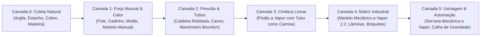

# 🏭 Tratado de Engenharia Industrial & Mecanismos: Todos os 33 Elementos da Era 1

> **Documento de Auditoria Técnica, Arqueometalurgia & Game Design Físico**  
> Projeto: *Industry Made* — Fabric Minecraft 26.1.2  
> Princípio Central: **Engenharia Tangível no Mundo vs. O "Crafting Table Mágico"**

---

## 1. 🧭 Manifesto: O Equilíbrio entre Realismo Físico e "Complexity Creep"

No desenvolvimento de mods de tecnologia para Minecraft, existem dois extremos que arruínam a experiência do jogador:

```
        [ O ABISMO VANILLA ]                                        [ O ABISMO GREGTECH ]
     "Crafting Table Mágico"                                       "Complexity Creep"
┌───────────────────────────────┐                             ┌───────────────────────────────┐
│ Você bota 8 barras de ferro e │      ✦ PONTO DE EQUILÍBRIO  │ Você precisa de 14 martelos,  │
│ um graveto na mesa de madeira │       INDUSTRY MADE:        │ 3 limas, 8 tipos de alicate e │
│ e sai um motor a vapor pronto.│  "Engenharia Tangível no    │ 40 parafusos só pra fazer uma │
│ Zero peso, zero física, zero  │   Mundo, Sem Microcrafting" │ chapa de metal. O jogo vira um│
│ sensação de realização real.  │                             │ trabalho chato de planilhas.  │
└───────────────────────────────┘                             └───────────────────────────────┘
```

### O Padrão de Engenharia do *Industry Made*:
1. **O Mundo é a Oficina:** Transformações térmicas, moldagens e conformações ocorrem no espaço 3D do bloco (calor, fluxo de ar, impacto cinético e gravidade), não dentro de uma grade 3x3 de madeira.
2. **Máquinas Criando Máquinas:** Para construir uma máquina avançada, você utiliza a máquina básica construída anteriormente. A progressão é uma escada mecânica contínua.
3. **Sem Microcrafting Descartável:** Nada de criar 30 ferramentas intermediárias que só servem para craftar uma peça e depois ficam esquecidas no baú. Toda peça tem propósito visível na carcaça da máquina.
4. **Princípio Anti-Bloqueio Circular:** Nenhuma máquina que consome pressão de vapor (como o Martelo Mecânico ou a Serraria) pode ser necessária para construir o gerador, tubulação ou medidor dessa mesma pressão.

---

## 2. 🪜 A Árvore de Dependência Linear Estrita (Camadas 0 a 5)

A progressão da Era 1 é dividida em 6 camadas estritamente sequenciais que garantem fluidez e zero bloqueio circular:



---

## 3. 🔨 Ferramentas Manuais vs Automação: O Martelo de Ferreiro e o Martelo Mecânico

### O Dilema do Early-Game:
No início do mod, o jogador precisa de chapas de bronze e fixadores para montar a primeira caldeira a vapor. No entanto, o jogador ainda **não possui vapor**. 
Se o Martelo Mecânico fosse o único meio de forjar chapas, o jogo sofreria um **bloqueio circular paradoxal**.

### A Solução Orgânica:
1. **Martelo de Ferreiro Manual (`blacksmith_hammer`):**
   * Fabricado com gravetos e pedra/bronze no Tier 1.
   * Possui durabilidade (ex: 200 usos).
   * Permite bater manualmente:
     * 1 Lingote de Bronze $\rightarrow$ **1 Chapa de Bronze (1:1)**.
     * 1 Haste de Bronze $\rightarrow$ **4 Rebites de Bronze (1:4)**.
   * O jogador sente o peso do trabalho artesanal do metal.

2. **O Triunfo do Martelo Mecânico a Vapor (`mechanical_hammer`):**
   * Conectado à rede de vapor ($\ge 1.5\text{ bar}$), ele transforma a escala de produção do jogador:
     * **Rendimento Dobrado (+100%):** 1 Lingote de Bronze $\rightarrow$ **2 Chapas de Bronze (1:2)**. Cada minério minerado rende o dobro!
     * **Multiplicação de Rebites:** 1 Haste de Bronze $\rightarrow$ **8 Rebites de Bronze**.
     * **Operação Autônoma:** Bate sozinho continuamente no mundo a cada 1.2 segundos sem intervenção humana.
     * **Matriz Pesada Exclusiva:** Estampa a lâmina dentada da serraria (`saw_blade`), purifica ferro em *Wrought Iron*, compacta serragem em briquetes combustíveis e brita minérios brutos em 2x pós.

---

## 4. 🔬 Análise Detalhada dos Sistemas Físicos Principais

### 4.1 O Cadinho de Fundição: Do Bloco Mágico à Cerâmica Sinterizada no Fogo
* **Antes:** 5 tijolos refratários em "U" na bancada 3x3 de madeira. Na vida real, tijolos montados sem queima conjunta vazariam bronze líquido a 1085°C pelas fendas imediatamente.
* **Depois:** O cadinho é modelado cru (**`unfired_crucible`**) a partir de argila refratária plástica (`fire_clay`). O jogador deve colocá-lo sobre calor ativo (fornalha, fogueira ou forja com fole) por 30 segundos no mundo real para que ocorra a transformação mineral em mulita sinterizada impermeável.

### 4.2 A Caldeira a Vapor: Caldeiraria Rebitada do Século XIX
* **Antes:** 5 chapas soltas de bronze coladas sobre 3 tijolos na bancada. Nenhum método de união mecânica para reter 6.0 bar de pressão de vapor saturado.
* **Depois:** Introdução dos **Rebites de Bronze (`bronze_rivets`)**. A caldeira exige chapas perfuradas e unidas por linhas de rebites batidos a quente (`5x bronze_plate + 4x bronze_rivets + 3x refractory_bricks`), trazendo a identidade estética das caldeiras históricas da Revolução Industrial.

### 4.3 O Manômetro de Bourdon: Telemetria Real Sem Paradoxo
* **Antes:** 1 tubo de bronze + 1 bússola vanilla magnética. Uma bússola detecta pólos magnéticos planetários, não pressão de fluidos. No rascunho preliminar, cogitou-se exigir o martelo a vapor para estampar o mostrador, reintroduzindo o paradoxo circular.
* **Depois:** Baseado na invenção real de Eugène Bourdon (1849). O tubo elástico achatado oval se desentorta microscopicamente com a pressão, transmitindo movimento a um ponteiro metálico analógico sob um mostrador com visor de vidro selado.
* **Receita Limpa de Tier 2:** `1x bronze_steam_pipe + 1x bronze_rod + 1x glass_pane`.

### 4.4 O Pistão Mecânico: O Tubo como Camisa do Cilindro
* **Antes:** 1 engrenagem + 1 chapa + 1 haste alinhadas verticalmente na bancada. Não havia carcaça tubular de retenção onde o vapor pudesse expandir adiabaticamente.
* **Depois:** O cilindro retificado onde o êmbolo corre é literalmente o **Tubo de Vapor (`bronze_steam_pipe`)**! Reutiliza um componente já existente na engenharia do mod:
* **Receita:** `1x bronze_steam_pipe` (camisa cilíndrica) + `1x bronze_rod` (haste/êmbolo) + `1x bronze_gear` (saída de força) + `1x bronze_plate` (tampa flangeada).

---

## 5. 📊 Matriz Completa de Decisões dos 33 Elementos da Era 1

| Elemento | Categoria | Mecânica Anterior (Bancada 3x3) | Mecânica Homologada (Física no Mundo) | Status |
| :--- | :--- | :--- | :--- | :--- |
| `fire_clay` | Matéria-prima | Argila + Areia na bancada | Encontrada em leitos de rios ou misturada com água | **Validado** |
| `fire_clay_block` | Bloco Natural | N/A | Gera naturalmente em leitos fluviais e pântanos | **Validado** |
| `fire_brick` | Cerâmica | Cozimento em fornalha | Queima de alta temperatura da argila refratária | **Validado** |
| `refractory_bricks` | Alvenaria | 4 tijolos 2x2 secos | 4 tijolos unidos com argamassa plástica de argila | **Refinar** |
| `bellows` | Térmica | Bancada: madeira + couro + ferro | Injeção manual de oxigênio (+500°C na forja) | **Validado** |
| `unfired_crucible` | Cerâmica Crua | Não existia | Modelado à mão com argila; cura no fogo da forja | **Novo** |
| `crucible` | Metalurgia | 5 tijolos em U na bancada | Cadinho sinterizado; funde Cu + Sn em bronze líquido | **Refinar** |
| `clay_mold` | Molde Cru | 3 bolas de argila na bancada | Molde cru; risco de choque térmico se não for assado | **Validado** |
| `ceramic_mold` | Molde Sinterizado | Cozido em fornalha | Molde permanente reutilizável para lingotes | **Validado** |
| `hot_ingot_mold` | Item Térmico | Têmpera em água/caldeirão | Resfriamento sonoro com vapor e desmolde físico | **Validado** |
| `tin_ore` | Minério | N/A | Veios de pedra natural no Overworld (Y -16 a 112) | **Validado** |
| `deepslate_tin_ore` | Minério | N/A | Veios densos em ardósia profunda com estanho bruto | **Validado** |
| `raw_tin` | Mineral Bruto | Drop de mineração | Cassiterita pura; funde a 232°C no cadinho | **Validado** |
| `tin_ingot` | Lingote Puro | Fundição em forno | Metal macio para ligas de bronze e soldas | **Validado** |
| `bronze_ingot` | Liga Metálica | Fundido no cadinho | Liga estrutural da Era 1 (resistente a corrosão) | **Validado** |
| `blacksmith_hammer` | Ferramenta | Não existia | Martelo manual de forja: chapas 1:1 e rebites 1:4 | **Novo** |
| `bronze_plate` | Chapa Pesada | 2 lingotes na bancada | Forjada no martelo manual (1:1) ou a vapor (1:2) | **Validado** |
| `bronze_rod` | Haste Mecânica | 2 lingotes verticais | Perfil usinado para eixos, êmbolos e ponteiros | **Validado** |
| `bronze_rivets` | Fixador | Não existia | Rebites de caldeiraria para suportar 6.0 bar de vapor | **Novo** |
| `bronze_gear` | Transmissão | Chapas + haste na bancada | Engrenagem de dentes retos para acoplamento mecânico | **Validado** |
| `wrought_iron_ingot`| Ferro Batido | Ferro no martelo a vapor | Ferro descarbonetado purificado com alta tenacidade | **Validado** |
| `iron_plate` | Chapa Pesada | Ferro forjado no martelo | Chapa rígida para trilhos, bigornas e lâminas de serra | **Validado** |
| `low_pressure_boiler`| Caldeiraria | 5 chapas soltas coladas | Vaso de pressão com rebites e alívio sonoro de vapor | **Refinar** |
| `bronze_steam_pipe` | Rede de Fluido | Chapas curvadas | Tubo com flanges; atua como camisa do pistão | **Validado** |
| `bronze_valve_pipe` | Válvula 3D | Tubo + engrenagem | Volante octogonal 3D com bloqueio estanque de vapor | **Validado** |
| `bronze_gauge_pipe` | Telemetria | Tubo + bússola mágica | Tubo Bourdon com ponteiro analógico e visor de vidro | **Refinar** |
| `steam_piston` | Cinética | Receita abstrata com gear | Cilindro de expansão de vapor usando o tubo | **Refinar** |
| `mechanical_hammer` | Matriz de Forja | Pistão + chapas + bigorna | Matriz mecânica a vapor: dobra chapas (1:2), lâminas | **Validado** |
| `saw_blade` | Usinagem | Não existia | Lâmina circular dentada forjada no martelo a vapor | **Novo** |
| `mechanical_sawmill`| Usinagem | Não existia | Serraria a vapor 60 FPS: 6 tábuas + serragem por tora | **Novo** |
| `sawdust` | Subproduto | Não existia | Serragem gerada no corte de toras; faz briquetes | **Novo** |
| `fuel_briquette` | Combustível | Não existia | 4 serragens prensadas no martelo; queima 8 itens | **Novo** |
| `gravity_chute` | Logística | Não existia | Calha inclinada física para alimentação de máquinas | **Novo** |
