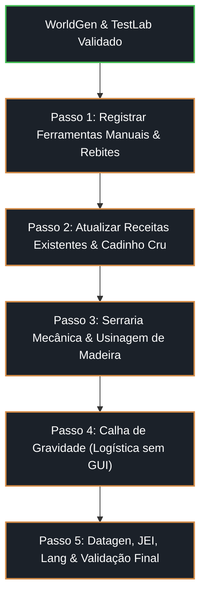

# 🤝 Plano de Passagem de Bastão (Handoff) & Retomada — Industry Made

> **Data de Atualização:** 25 de Setembro de 2026  
> **Status do Repositório:** 100% Limpo, Compilando e Testado (`origin/main`)  
> **Destinado a:** Continuação do desenvolvimento em outro computador / novo agente.

---

## 📌 1. Visão Geral do Estado Atual do Projeto

O mod **Industry Made** completou o slice vertical de infraestrutura básica da **Era 1 (Vapor & Forja Primitiva)** no Minecraft 26.1.2.
Todos os commits estão sincronizados com o repositório remoto `https://github.com/patitow/industry-made-fabric-26.1.2.git` na branch `main`.

### ⚙️ Stack Homologada:
- **Minecraft:** `26.1.2`
- **Fabric Loader:** `0.19.5`
- **Fabric Loom:** `1.18.2`
- **Kotlin:** `2.4.20` (`fabric-language-kotlin: 1.14.1+kotlin.2.4.20`)
- **Java Runtime:** `Java 25` (com JDK configurado em `gradle.properties`)
- **Testes Automatizados:** 17 testes unitários JUnit 5 passando com sucesso (`./gradlew.bat test` -> `BUILD SUCCESSFUL`).

---

## 🏛️ 2. Decisões Arquiteturais & Filosofia de Design Estabelecidas

Após exaustivo estudo termodinâmico, arqueometalúrgico e de game design (documentado interativamente em [`docs/engineering_study.html`](file:///D:/.Minecraft%20Mod%20Development/industry-made-fabric-26.1.2/docs/engineering_study.html) e em [`docs/ERA1_MACHINERY_STUDY.md`](file:///D:/.Minecraft%20Mod%20Development/industry-made-fabric-26.1.2/docs/ERA1_MACHINERY_STUDY.md)), foram consagradas as seguintes diretrizes:

### 2.1 Princípio da Progressão Linear Sem Bloqueio Circular
* **Regra Absoluta:** Nenhuma máquina que consome pressão de vapor (como o Martelo Mecânico ou a Serraria) pode ser pré-requisito para fabricar os componentes que geram, conduzem ou monitoram essa mesma pressão (Caldeira, Tubos e Manômetro).
* **A Escada Tecnológica Estrita (Camadas 0 a 5):**
  1. **Camada 0 (Natureza):** Coleta de Argila Refratária (`fire_clay_block`), Minério de Estanho (`tin_ore`), Cobre e Madeira.
  2. **Camada 1 (Forja Manual):** Cadinho cru curado na forja, fole manual, fusão de bronze, e o **Martelo de Ferreiro Manual (`blacksmith_hammer`)**.
  3. **Camada 2 (Pressão & Telemetria):** Caldeira de Baixa Pressão rebitada (`bronze_rivets`), tubos de vapor, válvula e **Manômetro Bourdon Sem Paradoxo**.
  4. **Camada 3 (Cinética Linear):** Pistão Mecânico a Vapor ($\ge 1.5\text{ bar}$), usando o próprio tubo de bronze como camisa do cilindro.
  5. **Camada 4 (Matriz Industrial de Forja):** Martelo Mecânico a vapor assumindo rendimento dobrado (1:2) e forja pesada.
  6. **Camada 5 (Indústria & Logística):** Serraria Mecânica a vapor (6 tábuas + serragem) e Calha de Gravidade sem GUI.

### 2.2 O Papel das Ferramentas Manuais (`blacksmith_hammer`)
* **Problema Resolvido:** O jogador precisava de chapas de bronze e rebites para montar a primeira caldeira, mas não tinha máquinas a vapor.
* **Solução:** O jogador fabrica o **Martelo de Ferreiro Manual** no início do jogo (madeira/pedra/bronze). Ele possui durabilidade e é usado na bancada ou sobre superfícies duras para bater:
  * 1 Lingote de Bronze $\rightarrow$ **1 Chapa de Bronze (1:1)**.
  * 1 Haste de Bronze $\rightarrow$ **4 Rebites de Bronze (1:4)**.
* **Incentivo à Automação com o Martelo Mecânico a Vapor (`mechanical_hammer`):**
  * Quando o jogador liga o Martelo Mecânico a vapor, ele **dobra o rendimento de chapas para 1:2** (1 lingote = 2 chapas) e rebites (1 haste = 8 rebites), trabalha sozinho sem gastar durabilidade, e estampa peças pesadas que o braço humano não tem força para deformar (lâminas de serra e briquetes).

### 2.3 Resolução do Paradoxo do Manômetro Bourdon (`bronze_gauge_pipe`)
* **Erro Eliminado:** Exigir o Martelo Mecânico a vapor para forjar o mostrador do manômetro gerava dependência circular insolúvel. Além disso, a bússola vanilla media magnetismo, não deformação elástica de pressão.
* **Solução Homologada:** O manômetro é baseado na patente histórica de 1849 de Eugène Bourdon (tubo achatado oval deformável).
* **Receita de Tier 2:** `bronze_steam_pipe` (tubo base) + `bronze_rod` (ponteiro indicador) + `glass_pane` (visor frontal selado). Pronto para uso antes de ligar qualquer pistão.

### 2.4 Cadinho Cru Sinterizado no Mundo (`unfired_crucible`)
* Em vez de colar 5 tijolos na bancada de madeira, o cadinho é modelado cru (`unfired_crucible`) a partir de `fire_clay` e deve ser posicionado sobre calor ativo (fornalha/fogueira) para queimar e virar o `crucible` funcional.

---

## 🗺️ 3. Próximos Passos de Implementação (Roadmap para a Próxima Máquina)

Quando você retomar o projeto no novo computador, o fluxo de trabalho deve seguir esta ordem precisa:



### 📋 Passo 1: Itens de Forja Manual & Fixadores
1. Criar e registrar em [`ModItems.kt`](file:///D:/.Minecraft%20Mod%20Development/industry-made-fabric-26.1.2/src/main/kotlin/dev/patitow/industrymade/init/ModItems.kt):
   * `blacksmith_hammer`: Classe de ferramenta com durabilidade (ex: 200 usos). Permite forjar receitas manuais e clicar na bigorna do martelo mecânico.
   * `bronze_rivets`: Item de caldeiraria empilhável (64x).
   * `unfired_crucible`: Cadinho cru moldado com argila refratária.
2. Criar texturas 16x16 em `textures/item/` (ou usar os geradores procedurais de `scratch/generate_html_report.py`).
3. Adicionar receitas manuais:
   * Gravetos + Pedra/Bronze $\rightarrow$ `blacksmith_hammer`.
   * `blacksmith_hammer` (retorna com dano) + `bronze_ingot` $\rightarrow$ `bronze_plate` (1:1).
   * `blacksmith_hammer` (retorna com dano) + `bronze_rod` $\rightarrow$ 4x `bronze_rivets`.

### 📋 Passo 2: Atualização de Receitas & Cura no Mundo
1. **Caldeira:** `low_pressure_boiler` passa a exigir `5x bronze_plate + 4x bronze_rivets + 3x refractory_bricks`.
2. **Manômetro:** `bronze_gauge_pipe` passa a exigir `1x bronze_steam_pipe + 1x bronze_rod + 1x glass_pane`.
3. **Pistão:** `steam_piston` passa a exigir `1x bronze_steam_pipe + 1x bronze_rod + 1x bronze_gear + 1x bronze_plate`.
4. **Cadinho Cru:** Criar lógica para o bloco ou item `unfired_crucible` sinterizar em `crucible` quando exposto a calor por $\ge 30$ segundos.

### 📋 Passo 3: Serraria Mecânica a Vapor (`mechanical_sawmill`)
1. Especificação completa em [`docs/SAWMILL_AND_CHUTE_SPEC.md`](file:///D:/.Minecraft%20Mod%20Development/industry-made-fabric-26.1.2/docs/SAWMILL_AND_CHUTE_SPEC.md).
2. Itens auxiliares:
   * `saw_blade`: Forjado sob o Martelo Mecânico a vapor a partir de `iron_plate` ou `bronze_plate`.
   * `sawdust`: Subproduto do corte de toras.
   * `fuel_briquette`: 4 serragens compactadas no Martelo Mecânico gerando combustível para 8 itens.
3. Bloco `mechanical_sawmill`:
   * Consome $\ge 1.5\text{ bar}$ de vapor de tubulação conectada.
   * Recebe toras no mundo físico e avança o tronco com animação fluida.
   * Disco de serra com rotação a 60 FPS via `BlockEntityRenderer` e interpolação `partialTicks`.
   * Ejeção de 6 tábuas + 1 serragem por tora (sem tela de inventário cinza!).

### 📋 Passo 4: Calha de Gravidade (`gravity_chute`)
1. Bloco inclinado sem interface gráfica.
2. Itens que caem dentro deslizam fisicamente pela gravidade até o bloco receptor inferior (alimentando cadinho com minérios, martelo com lingotes e serraria com toras).

---

## 🛠️ 4. Guia Rápido de Configuração no Novo Computador

Ao clonar o repositório na outra máquina:

1. **Clonar Repositório:**
   ```bash
   git clone https://github.com/patitow/industry-made-fabric-26.1.2.git
   cd industry-made-fabric-26.1.2
   ```

2. **Verificar JDK (Java 25 Obrigatório):**
   * Certifique-se de ter o JDK 25 instalado (ex: Eclipse Adoptium 25 ou Oracle OpenJDK 25).
   * Ajuste o caminho em `gradle.properties` se necessário (`org.gradle.java.home=...`).

3. **Validar Compilação & Testes Imediatamente:**
   ```powershell
   ./gradlew.bat compileKotlin
   ./gradlew.bat compileClientKotlin
   ./gradlew.bat test
   ```
   *Se os testes passarem (`BUILD SUCCESSFUL`), o ambiente está 100% pronto!*

4. **Comandos Úteis de Teste In-Game:**
   * `/im testlab` — Constrói a bancada completa com forjas, foles, caldeira, manômetro, pistão, martelo e mostruário de minérios.
   * `/im kit` — Equipa o jogador com todos os itens, moldes, baldes, combustíveis e ligas da Era 1.

---

## 📂 5. Arquivos de Documentação & Referência no Repositório

| Arquivo | Descrição |
| :--- | :--- |
| [`docs/HANDOFF.md`](file:///D:/.Minecraft%20Mod%20Development/industry-made-fabric-26.1.2/docs/HANDOFF.md) | Este guia de transição e plano de execução. |
| [`docs/engineering_study.html`](file:///D:/.Minecraft%20Mod%20Development/industry-made-fabric-26.1.2/docs/engineering_study.html) | Dashboard interativo v2.0 com diagramas SVG, fluxo de camadas e matriz dos 33 itens. |
| [`docs/ERA1_MACHINERY_STUDY.md`](file:///D:/.Minecraft%20Mod%20Development/industry-made-fabric-26.1.2/docs/ERA1_MACHINERY_STUDY.md) | Tratado profundo com análise física, arqueometalúrgica e antes x depois de cada bloco. |
| [`docs/SAWMILL_AND_CHUTE_SPEC.md`](file:///D:/.Minecraft%20Mod%20Development/industry-made-fabric-26.1.2/docs/SAWMILL_AND_CHUTE_SPEC.md) | Especificação técnica completa da Serraria Mecânica e Calha de Gravidade. |
| [`DESIGN_AND_ROADMAP.md`](file:///D:/.Minecraft%20Mod%20Development/industry-made-fabric-26.1.2/DESIGN_AND_ROADMAP.md) | Documento mestre de visão de game design, 3 Eras e combate ao "vazio" vanilla. |
| [`AGENTS.md`](file:///D:/.Minecraft%20Mod%20Development/industry-made-fabric-26.1.2/AGENTS.md) / [`GEMINI.md`](file:///D:/.Minecraft%20Mod%20Development/industry-made-fabric-26.1.2/GEMINI.md) | Regras estritas de segurança em auto-accept (não deletar nada, git não-destrutivo). |
