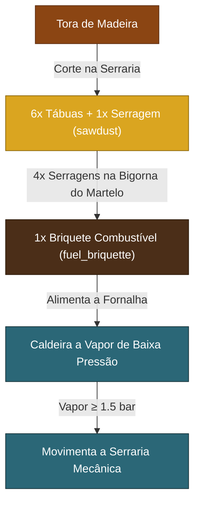

# 🪵 Especificação Técnica: Serraria Mecânica a Vapor (`mechanical_sawmill`) & Calha de Gravidade (`gravity_chute`)

> **Documento de Especificação Técnica & Arquitetura de Implementação**  
> Projeto: *Industry Made* — Fabric Minecraft 26.1.2  
> Princípio Central: **Usinagem Mecânica no Mundo, Animação Suave (60 FPS) e Automação Física Sem GUI**

---

## 1. ⚙️ Subsistemas Mecânicos da Serraria a Vapor

Inspirada nas serrarias a vapor do século XIX (Oliver Evans / James Watt), a **Serraria Mecânica** divide-se em 4 subsistemas físicos:

```
                  CILINDRO DE EXPANSÃO (Vapor ≥ 1.5 bar)
                                  │
                                  ▼
                     BIELA-MANIVELA & ENGRENAGEM
                 (Converte curso linear em rotação)
                                  │
                                  ▼
                   DISCO DE SERRA DENTADO GIRATÓRIO
                   (saw_blade estampada no martelo)
                                  │
                                  ▼
              LEITO GUIADO DE CORTE (Log Carriage 3D)
                   (A tora desliza contra o disco)
                                  │
                ┌─────────────────┴─────────────────┐
                ▼                                   ▼
      6x Tábuas de Madeira                 1x Serragem (sawdust)
    (+50% rendimento vs vanilla)         (Matéria do briquete)
```

---

## 2. 🔨 Cadeia de Forja: A Matriz do Martelo Mecânico

Para que a serraria não seja criada magicamente na bancada de madeira, ela utiliza componentes estampados pelas máquinas anteriores:

1. **Lâmina de Serra Dentada (`saw_blade`):**
   * Fabricada colocando uma **Chapa de Bronze (`bronze_plate`)** ou **Chapa de Ferro (`iron_plate`)** sobre a bigorna do **Martelo Forjador Mecânico (`mechanical_hammer`)**.
   * Três golpes ritmados a vapor estampam o furo central e os dentes perimétricos afiados.
2. **Montagem da Serraria (`mechanical_sawmill`):**
   * `1x saw_blade` + `1x steam_piston` + `2x bronze_plate` + `2x tábuas de madeira` + `1x bronze_gear`.
   * Reutiliza peças existentes com perfeita coerência industrial.

---

## 3. 📐 Comportamento In-Game & Renderização Suave (60 FPS)

### 3.1 Mecânica Sem GUI ("Zero Caixas Cinzas"):
* **Alimentação:** O jogador (ou a Calha de Gravidade) posiciona uma tora de madeira (`#minecraft:logs`) na bancada de entrada.
* **Operação:**
  * Se a pressão de vapor conectada for $\ge 1.5\text{ bar}$, o disco dentado entra em rotação contínua e um som grave de corte em madeira com faíscas/partículas de serragem é emitido.
  * A tora desliza fisicamente para a frente em um ciclo de **3.0 segundos**.
* **Ejeção:**
  * Na face frontal/oposta, são ejetadas **6 Tábuas de Madeira** do tipo correspondente (+50% de eficiência em relação às 4 do vanilla).
  * Na parte inferior/traseira, é ejetada **1x Serragem (`sawdust`)**.

### 3.2 Suavidade Visual (`partialTicks`):
* O disco de serra e o carro de avanço utilizam interpolação angular no `BlockEntityRenderer`:
  $$\theta(t) = \theta_{\text{prev}} + (\theta_{\text{current}} - \theta_{\text{prev}}) \cdot \text{partialTicks}$$
* Garante 60+ FPS fluidos mesmo sob variações de TPS do servidor.

---

## 4. ♻️ O Ciclo Fechado da Serragem & Briquetagem

A serragem gerada resolve o gargalo de combustível da Era 1:



* **Briquete Combustível (`fuel_briquette`):**
  * 4 unidades de `sawdust` prensadas sob o Martelo Mecânico forjam 1 briquete denso.
  * Queima 8 itens na caldeira ou fornalha.
  * Cria o primeiro loop de autossustentabilidade industrial: a madeira serrada alimenta a caldeira que move a própria serraria!

---

## 5. 🛝 A Calha de Gravidade (`gravity_chute`)

### 5.1 O Fim dos Funis "Mágicos" Vanilla:
* Os funis vanilla teletransportam itens por dentro de caixas pretas sem física real.
* A **Calha de Gravidade (`gravity_chute`)** é uma calha metálica/cerâmica aberta inclinada a 45 graus.

### 5.2 Mecânica Física:
* **Entrada:** Itens jogados pelo jogador, descartados por mineradores ou expelidos por máquinas adjacentes caem na boca larga superior.
* **Trajetória Física:** O item desliza com atrito e aceleração visível ao longo da calha.
* **Saída:** O item cai no bloco receptor abaixo:
  * Despeja cobre e estanho diretamente na boca aberta do **Cadinho (`crucible`)**.
  * Despeja lingotes e chapas na bigorna do **Martelo Mecânico (`mechanical_hammer`)**.
  * Despeja toras de madeira no leito da **Serraria Mecânica (`mechanical_sawmill`)**.
* Sem tela de inventário, sem consumo de energia elétrica: pura mecânica newtoniana.

---

## 6. 💻 Esboço de Arquitetura de Código

### 6.1 Novos Registros (`ModItems.kt` & `ModBlocks.kt`):
```kotlin
// ModItems.kt
val SAW_BLADE: Item = registerItem("saw_blade") { DescriptiveItem(...) }
val SAWDUST: Item = registerItem("sawdust") { DescriptiveItem(...) }
val FUEL_BRIQUETTE: Item = registerItem("fuel_briquette") { FuelItem(burnTicks = 1600, ...) }

// ModBlocks.kt
val MECHANICAL_SAWMILL: Block = registerBlock("mechanical_sawmill") { MechanicalSawmillBlock(...) }
val GRAVITY_CHUTE: Block = registerBlock("gravity_chute") { GravityChuteBlock(...) }
```

### 6.2 Lógica do `MechanicalSawmillBlockEntity.kt`:
```kotlin
class MechanicalSawmillBlockEntity(pos: BlockPos, state: BlockState) : BlockEntity(...) {
    var cutProgress: Int = 0
    var bladeAngle: Float = 0f
    var prevBladeAngle: Float = 0f

    fun tick(level: Level, pos: BlockPos, state: BlockState) {
        val pressure = SteamSystem.getAvailablePressure(level, pos)
        if (pressure >= 1.5f && hasLogOnBed()) {
            prevBladeAngle = bladeAngle
            bladeAngle += 24.0f // Giro contínuo
            cutProgress++
            if (cutProgress >= 60) { // 3 segundos (20 tps * 3)
                finishCut(level, pos)
                cutProgress = 0
            }
        }
    }
}
```
